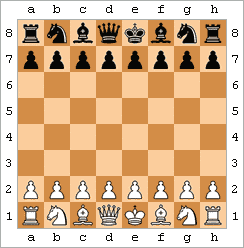

# Chess-Winner-Prediction by RNN
Chess Winner Prediction using the Moves as the input data. 

# CHESS
Chess is an abstract strategy game that involves no hidden information and no elements of chance. It is played on a chessboard with 64 squares arranged in an 8×8 grid. At the start, each player controls sixteen pieces: one king, one queen, two rooks, two bishops, two knights, and eight pawns. White moves first, followed by Black. The game is won by checkmating the opponent's king, i.e. threatening it with inescapable capture. There are also several ways a game can end in a draw.[Ref link](https://en.wikipedia.org/wiki/Chess).

## CHESS BOARD. 

 **For move chess moves refer to the link.** [Chess.com](https://www.chess.com/terms/chess-pieces)

 # Talking about the dataset: 
 This is a set of just over 20,000 games collected from a selection of users on the site Lichess.org, and how to collect more. I will also upload more games in the future as I collect them. This set contains the:

Game ID;
Rated (T/F);
Start Time;
End Time;
Number of Turns;
Game Status;
Winner;
Time Increment;
White Player ID;
White Player Rating;
Black Player ID;
Black Player Rating;
All Moves in Standard Chess Notation;
Opening Eco (Standardised Code for any given opening, list here);
Opening Name;
Opening Ply (Number of moves in the opening phase)
For each of these separate games from Lichess. I collected this data using the Lichess API, which enables collection of any given users game history. The difficult part was collecting usernames to use, however the API also enables dumping of all users in a Lichess team. There are several teams on Lichess with over 1,500 players, so this proved an effective way to get users to collect games from.

Possible Uses

Lots of information is contained within a single chess game, let alone a full dataset of multiple games. It is primarily a game of patterns, and data science is all about detecting patterns in data, which is why chess has been one of the most invested in areas of AI in the past. This dataset collects all of the information available from 20,000 games and presents it in a format that is easy to process for analysis of, for example, what allows a player to win as black or white, how much meta (out-of-game) factors affect a game, the relationship between openings and victory for black and white and more.

**For Downloading the Dataset:** [Kaggle Link](https://www.kaggle.com/datasets/datasnaek/chess) - by MITCHELL J.

**Project Idea:** [Youtube](https://www.youtube.com/watch?v=G5KFh9UZNfY)
